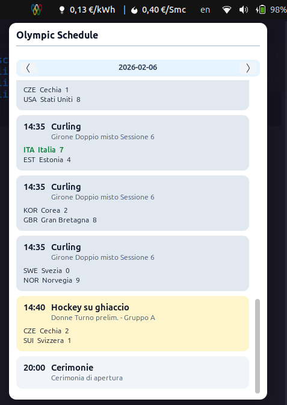

# Olympic Schedule (GNOME Shell Extension)

Estensione per GNOME Shell che aggiunge un’icona in topbar e mostra, al click sinistro, il programma olimpico del giorno per il NOC selezionato. Il click destro apre un menu con accesso alle impostazioni.

## Funzionalità
- Icona in topbar con 5 cerchi stilizzati.
- Click sinistro: popup con calendario giornaliero e navigazione tra i giorni.
- Click destro: menu con voce **Settings**.
- Preferenze: impostazione del NOC (es. `ITA`).

## Screenshot


## Installazione
1. Clona o copia la cartella dell’estensione in:
   `~/.local/share/gnome-shell/extensions/olympic-schedule@sydro.github.com`
2. Compila lo schema GSettings:
   ```bash
   glib-compile-schemas ~/.local/share/gnome-shell/extensions/olympic-schedule@sydro.github.com/schemas
   ```
3. Abilita l’estensione:
   ```bash
   gnome-extensions enable olympic-schedule@sydro.github.com
   ```
4. Se necessario, riavvia GNOME Shell (Alt+F2, poi `r`) o effettua logout/login.

## Note
- L’estensione recupera i dati dal feed ufficiale `olympics.com` usando il NOC configurato.
- Repository: `github.com/sydro/olympic-schedule.git` (codice sorgente)
- Fonte dati: `https://www.olympics.com/en/milano-cortina-2026` (sito ufficiale)
- Il popup si chiude con **ESC**.

## Troubleshooting
- Le preferenze non si aprono: verifica di aver compilato gli schemi con `glib-compile-schemas`.
- L’estensione non si aggiorna: disabilita/riabilita con `gnome-extensions disable/enable` oppure riavvia GNOME Shell.
- Il popup non mostra dati: controlla che il NOC sia valido (es. `ITA`) e che la data abbia eventi disponibili.

## Sviluppo
Se lavori nel repository, puoi usare un symlink verso la directory di GNOME Shell:
```bash
ln -sfn "$(pwd)" ~/.local/share/gnome-shell/extensions/olympic-schedule@sydro.github.com
```
